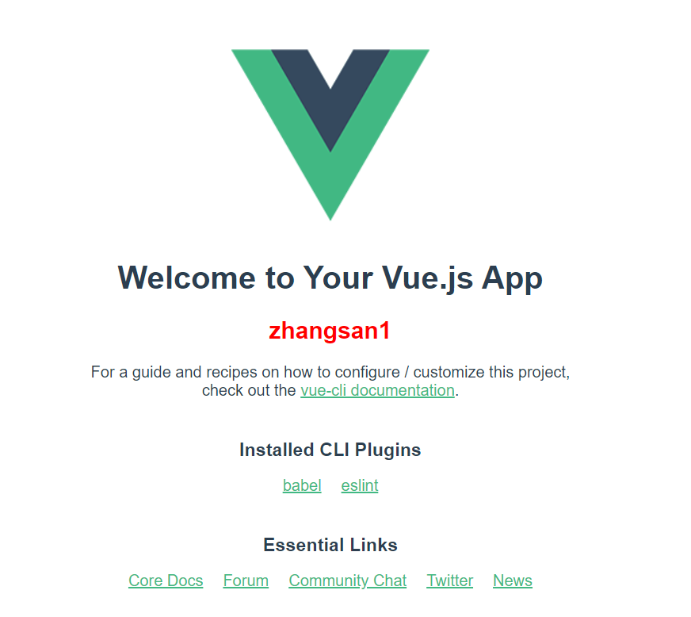
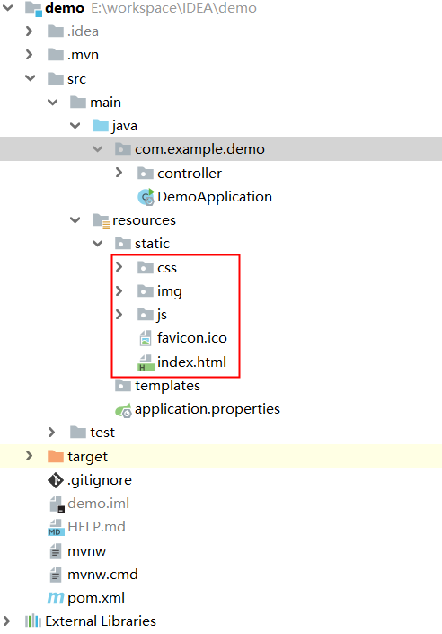

## SpringBoot+Vue前后端快速开发

目的：记录前后端整合过程


## 后端（SpringBoot）

前置：Java环境

项目搭建

```text
借助spring官方脚手架快速搭建，网址：https://start.spring.io/，主要选择Project=>Maven Project, Language=> Java，Spring Boot=>选择不带SNAPSHOT的，Dependencies选择Web 下的 Spring Web，点击绿色按钮下载maven工程，解压后导入idea中，工程结构如下：

E:\WORKSPACE\IDEA\DEMO
├─.idea
├─.mvn
└─ src	          --源码目录
│    ├─main
│    │  ├─java
│    │  │  └─com
│    │  │      └─example
│    │  │          └─demo
│    │  │			  └─DemoApplication.java   ---springboot 启动入口
│    │  └─resources
│    │      ├─static
│    │      ├─templates
|    |      └─application.properties	--配置文件，默认为空
│    └─test
│        └─java
│            └─com
│                └─example
│                    └─demo
└─ pom.xml  
```

***模拟CRUD*** 在demo包下新建包controller，新建ExampleController.java,代码如下

```java
package com.example.demo.controller;

import org.springframework.http.HttpEntity;
import org.springframework.http.HttpStatus;
import org.springframework.http.ResponseEntity;
import org.springframework.web.bind.annotation.*;

import javax.annotation.PostConstruct;
import java.util.HashMap;
import java.util.Map;
import java.util.concurrent.ThreadLocalRandom;

@RestController
@RequestMapping("/api/person")
public class ExampleController {

    private final Map<Integer, Person> peronlist = new HashMap<>();

    @PostConstruct
    public void init() {
        for (int i = 0; i < 5; i++) {
            peronlist.put(i, new Person("zhangsan" + i, i));
        }
    }

    @GetMapping("/hello")
    public HttpEntity hello() {
        ResponseEntity<String> result = ResponseEntity.ok("hello");
        return result;
    }

    @PostMapping("")
    public HttpEntity<Inteegr> save(@RequestBody Person p) {
        int uid = ThreadLocalRandom.current().nextInt(100, 999);
        peronlist.put(uid, p);
        return new ResponseEntity(uid, HttpStatus.OK);
    }

    @GetMapping("/{uid}")
    public HttpEntity<Person> get(@PathVariable int uid) {
        Person p = peronlist.get(uid);
        return new ResponseEntity(p, HttpStatus.OK);
    }

    @PutMapping("/{uid}")
    public HttpEntity<Boolean> upd(@PathVariable int uid, @RequestBody Person p) {
        peronlist.put(uid, p);
        return new ResponseEntity(true, HttpStatus.OK);
    }

    @DeleteMapping("/{uid}")
    public HttpEntity<Boolean> del(@PathVariable int uid) {
        peronlist.remove(uid);
        return new ResponseEntity(true, HttpStatus.OK);
    }

}

class Person {
    private String name;
    private int age;

    public Person(String name, int age) {
        this.name = name;
        this.age = age;
    }

    public String getName() {
        return name;
    }

    public void setName(String name) {
        this.name = name;
    }

    public int getAge() {
        return age;
    }

    public void setAge(int age) {
        this.age = age;
    }
}

```

小小配置 `application.properties`

```text
# 指定服务地址、端口
server.address=192.168.1.147
server.port=9090
```

启动工程，选择DemoApplication 右键Run  DemoApplication 

```text
网页访问：http://192.168.1.147:9090/api/person/1
返回：{"name":"zhangsan1","age":1}

至此：服务端/后台演示到此结束
```


## 前端（Vue）

前置：node环境

项目搭建

```text
#安装 vue官方脚手架
npm install -g @vue/cli

# 初始化项目，名称暂时取为vue-demo
vue create vue-demo

# 开发工具选用 WebStorm或VS code均可

# 工程结构如下：
E:\WORKSPACE\VSC\VUE\VUE-DEMO
├─node_modules  
├─public
|  ├─favicon.ico
|  └─index.html
└─src					--源码目录
|   ├─assets
|   |   └─logo.png
|   └─components      
|   | 	└─HelloWorld.vue
|   ├─App.vue
|   └─main.js       
├─.gitignore    
├─babel.config.js
├─package-lock.json
└─package.json

```

vue验证启动

```text
#安装js依赖包
npm install  

#启动vue工程
npm run serve

# 网页访问 http://localhost:8081/ 就能看到Vue欢迎界面
```

注意，到目前为止：Vue还不具备与后台交互的能力，因此我们需要安装 `axios` ，进入Vue项目根目录下执行如下命令

```text
 npm i axios -S
```

写代码拉取后台数据 编辑main.js，新增代码如下

```text
import axios from 'axios'

Vue.prototype.$axios = axios
```

同时编辑HelloWorld.vue，找到`<script>`标签,修改内容如下

```javascript
<script>

export default {
  name: 'HelloWorld',
  props: {
    msg: String
  },
  created () {
    this.fetchData()
  },
  methods: {
    fetchData () {
      this.$axios.get('/api/person/1').then(res => {
        // eslint-disable-next-line no-console
        console.log(res)
      });
    }
  }
}

</script>
```

```text
保存文件后重新访问 http://localhost:8081/
F12开发者工具会发现请求报错，因为默认请求走的vue端口，因此我们需要将Vue页面上数据请求接口全部代理到Java后台接口，就需要给Vue工程配置代理
```


## 前端接口代理<开发阶段>

**假设** 前端地址：localhost:8081，请求方法 `/api/**` 需要与后台交互

后端服务地址：localhost:9090，可以接受请求 `/api/**` ,那么只需要代理地址，方法无须重写

参考：<https://segmentfault.com/a/1190000014474361?utm_source=channel-hottest>

在根目录下新建一个 vue.config.js 文件，拷贝如下代码

```javascript
module.exports = {
  // cli3 代理是从指定的target后面开始匹配的，不是任意位置；配置pathRewrite可以做替换
  devServer: {
    proxy: {
      '/api': {
        target: 'http://192.168.1.147:9090', //注意加上http
        changeOrigin: true
      }
    }
  }
}

```

可能会有报错，错误信息如下：`Proxy error: Could not proxy request /api/person/1 from localhost:8081 to localhost:8080 (ENOTFOUND) ` 

解决方案：关闭Vue项目重启，浏览器清除缓存<玄学>  [参考](https://blog.csdn.net/reagan_/article/details/97498160)

一切问题解决后，F12开发者工具中的Console应该能看到消息


为了使得信息呈现的比较明显，使用Vue模板语法将数据显示到网页上

编辑HelloWorld.vue，找到{{msg}}，在其下面添加一行代码 

```text
<h2 v-bind="person style="color:red">{{person.name}}</h2>
```

同时继续修改HelloWrold，找到`<script>`内容，修改如下：

```javascript
<script>
export default {
  name: 'HelloWorld',
  props: {
    msg: String
  },
  data () {
    // eslint-disable-next-line no-undef
    return {
      person: []
    }
  },
  created () {
    this.fetchData()
  },
  methods: {
    fetchData () {
      this.$axios.get('/api/person/1').then(res => {
        // eslint-disable-next-line no-console
        console.log(res)
        this.person = res.data
      });
    }
  }
}
</script>
```



至此前后端接口调通，并能展示内容，虽然只是演示了Get请求，其他请求类似，遇到问题再去百度吧


## Vue工程与SpringBoot整合

Vue 根目录执行打包命令

```cmd
npm run-script build
```

在Vue工程生成一个文件夹 `dist` ，结构如下：

```text
E:\WORKSPACE\VSC\VUE\VUE-DEMO\DIST
├─css --文件夹
├─img --文件夹
├─js  -- 文件夹
├─favicon.ico
└─index.html
```

复制全部内容拷贝到SpringBoot工程，位置`src/main/resources/static` 



重启SpringBoot项目，访问 `192.168.1.147:9090` ，看到熟悉的界面，完美！


## Vue项目独立部署代理问题

**假设** 将Vue项目部署到Linux环境下的nginx服务器上 [参考](https://www.linuxprobe.com/nginx-proxy-pass.html)

首先Vue项目打包，依旧生成dist文件夹，目录结构与上文一致，整个文件夹上传到Linux，假设地址如下

```text
/home/leijunjun/vue/dist
```

然后配置Nginx环境，找到Nginx配置文件 `/usr/local/nginx/conf/nginx.conf`

```shell
# 在http标签包裹内部  新增如下内容
#说明：nginx监听10086端口，转发/请求找到 root对应目录下的叫做index.html或index.htm的静态文件，
#      将/api请求转发到proxy_pass对应的服务地址，类似与Vue开发时候配置的代理设置，有点不同的在于nginx中特殊语法，其中需要注意转发方法被截断问题

    # nginx服务及监听地址
    server {
        listen       10086;
        server_name  192.168.56.128;
		 
        location / {
            root   /home/leijunjun/vue/dist;
            index  index.html index.htm;
        }

        location /api {
             # 后端服务地址
             proxy_pass  http://192.168.1.147:9090$request_uri;
             proxy_set_header Host $host:$server_port;
        }
    }   
```

启动nginx 

```shell
./usr/local/nginx/sbin/nginx 
```

网页访问 `http://192.168.56.128:10086`  又是熟悉的画面


## 警告

上述均为示例代码，还有很多不完善之处，本文档目的只是为了快速展示前后端交互，其他内容请百度